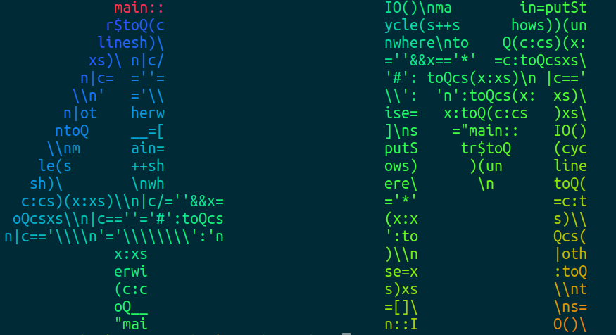

# Quine for Haskell


## INDEX

- [ABOUT](#about)
- [ENVIRONMENT](#environment)
- [PREPARING](#preparing)
- [HOW TO USE](#how-to-use)

---

## ABOUT

[QUINE](https://ja.wikipedia.org/wiki/%E3%82%AF%E3%83%AF%E3%82%A4%E3%83%B3_(%E3%83%97%E3%83%AD%E3%82%B0%E3%83%A9%E3%83%9F%E3%83%B3%E3%82%B0)) for Haskell.

---

## ENVIRONMENT

- Haskell

---

## PREPARING

```shell
git clone https://github.com:RyosukeDTomita/quine-haskell.git
cd quine-haskell
nix develop
```

---

## HOW TO USE

```shell
runghc <path to hs>
```

---

## EXAMPLE

```shell
runghc 4M.hs
              main::                          IO()\nma        in=putSt
             r$toQ(c                          ycle(s++s      hows))(un
            linesh)\                          nwhere\nto    Q(c:cs)(x:
           xs)\ n|c/                          =''&&x=='*'  =c:toQcsxs\
          n|c=  =''=                          '#': toQcs(x:xs)\n |c=='
         \\n'   ='\\                          \\':  'n':toQcs(x:  xs)\
        n|ot    herw                          ise=   x:toQ(c:cs   )xs\
       ntoQ     __=[                          ]\ns    ="main::    IO()
      \\nm      ain=                          putS     tr$toQ     (cyc
     le(s       ++sh                          ows)      )(un      line
    sh)\        \nwh                          ere\       \n       toQ(
   c:cs)(x:xs)\\n|c/=''&&x=                   ='*'                =c:t
  oQcsxs\\n|c==''='#':toQcs                   (x:x                s)\\
 n|c=='\\\\n'='\\\\\\\\':'n                   ':to                Qcs(
              x:xs                            )\\n                |oth
              erwi                            se=x                :toQ
              (c:c                            s)xs                \\nt
              oQ__                            =[]\                \ns=
              "mai                            n::I                O()\
```

### Combination of other tools

- [TerminalTextEffects](https://gigazine.net/news/20240529-terminal-text-effects/)

  [!TerminalTExtEffects](./assets/tte.gif)

- [lolcat](https://github.com/busyloop/lolcat)

  
