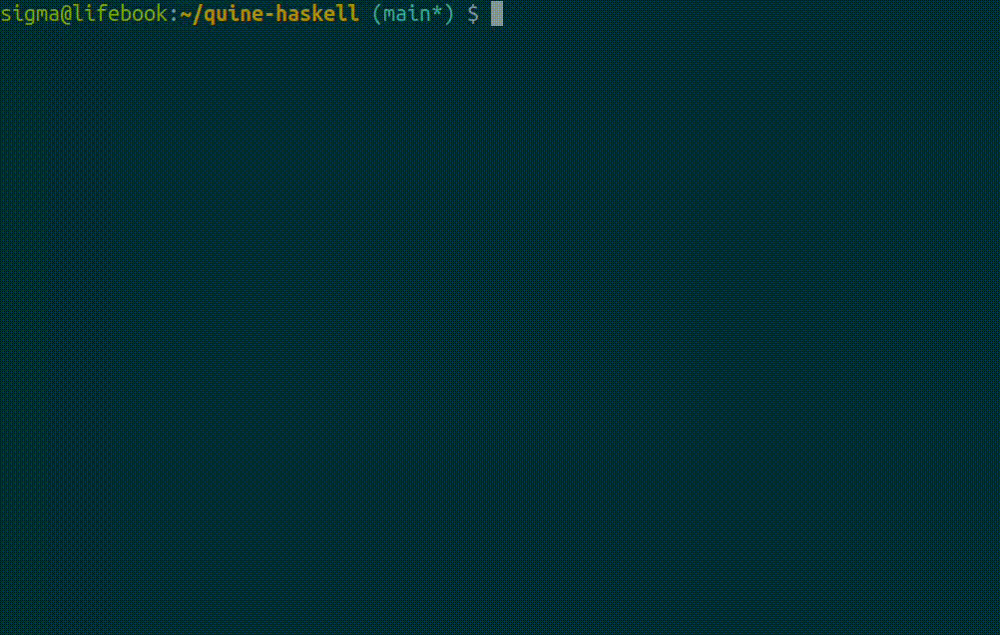
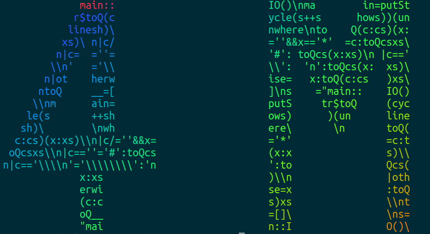

# Quine for Haskell


## INDEX

- [ABOUT](#about)
- [ENVIRONMENT](#environment)
- [PREPARING](#preparing)
- [HOW TO USE](#how-to-use)

---

## ABOUT

[QUINE](https://ja.wikipedia.org/wiki/%E3%82%AF%E3%83%AF%E3%82%A4%E3%83%B3_(%E3%83%97%E3%83%AD%E3%82%B0%E3%83%A9%E3%83%9F%E3%83%B3%E3%82%B0)) for Haskell.

---

## ENVIRONMENT

- Haskell

---

## PREPARING

```shell
git clone https://github.com:RyosukeDTomita/quine-haskell.git
cd quine-haskell
nix develop
```

---

## HOW TO USE

```shell
runghc <path to hs>
```

---

## EXAMPLE

```shell
runghc 9M.hs
    main::IO()\nmain=put                Str$toQ(        cycle(s+
   +shows))(unlinesh)\nwh               ere\ntoQ(      c:cs)(x:x
  s)\n|c/=''&&x=='*'=c:toQ              csxs\n|c==    ''='#':toQ
  cs(x                :xs)              \n|c=='\\n'  ='\\\\':'n'
  :toQ                cs(x              :xs) \n|otherwise= x:toQ
  (c:c                s)xs              \nto  Q__=[]\ns="m  ain:
  :IO(                )\\n              main   =putStr$to   Q(cy
  cle(s++shows))(unlinesh)              \\nw    here\\nt    oQ(c
   :cs)(x:xs)\\n|c/=''&&x=              ='*'     =c:toQ     csxs
    \\n|c==''='#':toQcs(x:              xs)\      \n|c      =='\
                      \\\n              '='\       \\       \\\\
                      \':'              n':t                oQcs
                      (x:x              s)\\                n|ot
                      herw              ise=                x:to
                      Q(c:              cs)x                s\\n
                      toQ_              _=[]                \\ns
    ="main::IO()\nmain=put              Str$                toQ(
   cycle(s++shows))(unli                nesh                )\nw
  here\ntoQ(c:cs)(x:xs                  )\n|                c/='
```

### Combination of other tools

- [TerminalTextEffects](https://gigazine.net/news/20240529-terminal-text-effects/)

  

- [lolcat](https://github.com/busyloop/lolcat)

  
